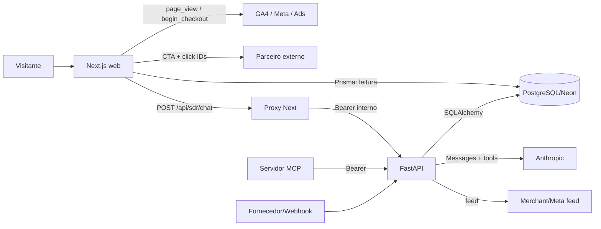

# Arquitetura atual

## Stack real

| Camada | Tecnologia | Versão/evidência |
|---|---|---|
| Web | Next.js App Router, React, TypeScript | Next 16.2.6, React 19.2.4 em `web/package.json` |
| Estilo | Tailwind CSS/PostCSS | Tailwind 4.3.0 |
| Acesso web ao banco | Prisma Client | 6.19.0 |
| API | FastAPI, Pydantic, SQLAlchemy async | `api/requirements.txt` |
| Driver DB | asyncpg | 0.30.0 |
| Banco | PostgreSQL; Neon indicado pela documentação | `DATABASE_URL`, Prisma + SQLAlchemy; segredo não inspecionado |
| Autenticação | JWT HS256 machine-to-machine | `api/app/security.py` |
| IA | Anthropic Messages API | `api/app/agents/sdr.py` |
| MCP | FastMCP Python | `mcp-server/rocha_smart_mcp` |
| Analytics | Meta Pixel, GA4, Google Ads/dataLayer | `web/src/components/analytics` |
| Deploy previsto | Vercel + Railway | `web/vercel.json`, `api/railway.json` |

## Diretórios e responsabilidade

- `web/`: experiência pública, leitura direta do catálogo pelo Prisma, pixels e proxy da Sara.
- `api/`: autenticação, CRUD, feeds, fornecedores, webhooks, analytics legado e agente Sara.
- `mcp-server/`: ferramentas operacionais para agentes externos; chama a API via Bearer.
- `web/prisma/`: schema compartilhado, mas sem diretório de migrations.
- `api/tests/`: cinco testes unitários adicionados no worktree atual.
- `docs/auditoria-rocha-smart/`: relatórios desta auditoria.

## Módulos principais

### Frontend

- Home: `web/src/app/page.tsx`.
- Produto: `web/src/app/p/[id]/page.tsx` e `ProductBridgeView.tsx`.
- Sara: `SaraWidget.tsx` → `/api/sdr/chat`.
- Afiliado: `product-bridge.ts`, `affiliate.ts`, `AffiliateCTA.tsx`.
- Analytics: `GlobalAnalytics.tsx`, `ClickIdCapture.tsx`, `analytics.ts`.
- SEO: `layout.tsx`, `robots.ts`, `sitemap.ts`, metadata de produto.

### Backend

- App/rotas: `api/app/main.py` registra 20 rotas.
- Banco: `database.py`, `models.py`, `crud/products.py`.
- Auth: `/auth/token`, `security.py`, `dependencies.py`.
- Produtos: `/api/products`.
- Catálogo: `/catalog/feed.xml` e `/catalog/feed.json`.
- Sara: `/agents/sdr/chat`.
- Fornecedores: `/api/integrations/suppliers`, `/api/suppliers/sync/{provider}`.
- Webhooks: `/webhooks/suppliers/{provider}/...`.

## Banco e domínio

`Product` concentra cadastro e preço. Conteúdo editorial flexível vive em `ai_metadata` JSONB. `Order`/`OrderItem` representam um e-commerce que não existe na jornada atual. `Campaign`/`CampaignProduct` existem apenas no Prisma, sem equivalentes SQLAlchemy, API ou UI.

Problemas arquiteturais:

1. dois ORMs compartilham tabelas sem migrations versionadas;
2. JSONB funciona como CMS informal sem schema editorial completo;
3. oferta, parceiro, loja e preço não são entidades próprias;
4. pedidos são tratados como vendas apesar do modelo afiliado;
5. campanha existe apenas no schema;
6. web consulta o banco diretamente, contornando regras da API.

## Autenticação e autorização

`POST /auth/token` troca `client_id`/`client_secret` por JWT com `sub` e `exp`. Qualquer subject autenticado recebe o mesmo poder nas rotas protegidas. Não há usuário humano, role, scope, `iss`, `aud`, `jti`, revogação ou rotação automatizada. O worktree atual rejeita defaults frágeis quando `APP_ENV=production`, o que é positivo, mas insuficiente.

## IA e fluxo da Sara

O browser envia uma mensagem ao proxy Next. O proxy acrescenta um JWT interno e chama FastAPI. O backend chama Anthropic e permite até oito loops, usando três tools que leem o catálogo. Não existe memória, RAG, perfil, sessão persistida, telemetria de tokens/custo ou rate limit.

## Integrações

- **PostgreSQL:** efetivamente consultado; Neon é indicado por README/comentários, não confirmado pelo valor secreto.
- **Anthropic:** código integrado; não chamado na auditoria para evitar custo.
- **Meta/Google:** scripts client-side condicionais a env; IDs não foram expostos.
- **Zendrop/AliExpress:** conectores genéricos, não validados contra APIs reais.
- **Amazon:** URL estática no seed, sem entidade ou integração de API.
- **Vercel/Railway:** configuração prevista; deploy não validado nesta auditoria.

## Fluxo de dados atual

## Fluxo de publicação real

Não há workflow de publicação. Um operador usa API, MCP, Prisma Studio ou seed para criar/editar `Product`; a home exibe os seis mais recentes imediatamente. Não existem `draft`, revisão, publicação agendada, expiração ou audit log.

## Deploy e operação

- Vercel deve usar `web` como Root Directory segundo o README.
- Há `vercel.json` na raiz e em `web/`, apesar do histórico/documentação afirmarem que o arquivo raiz deveria ser removido. Essa divergência deve ser resolvida antes do deploy.
- Railway inicia Uvicorn; `Procfile` inclui worker opcional, mas o worker é apenas um loop.
- Não há CI/CD, Docker, infraestrutura como código ou smoke test pós-deploy.
