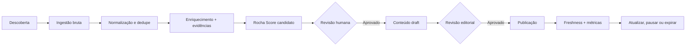
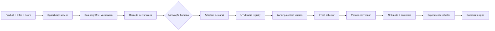

# Automação e campanhas

## Processo atual

Não existe pipeline operacional completo. Produtos podem ser criados pela API, MCP, Prisma Studio ou seed e aparecem imediatamente. Fornecedores oferecem preview/persist por SKUs informados. O MCP gera copy sob demanda, mas não salva nem publica. O worker apenas dorme em loop. Campaigns existem somente no Prisma.

## Tarefas manuais atuais

- escolher produto;
- pesquisar ficha e claims;
- montar JSON editorial;
- cadastrar preço, imagem e URL;
- revisar factualidade;
- conferir oferta;
- acompanhar link e pixels;
- atualizar conteúdo;
- decidir campanha;
- reconciliar comissão fora do sistema.

## Estado das automações existentes

| Automação | Estado | Limite |
|---|---|---|
| CRUD via MCP | Parcial | Sem scopes/aprovação/audit log |
| Tendências | Mock | Mapa fixo de SKUs |
| Supplier preview | Parcial | Endpoint genérico, sem contrato validado |
| Supplier persist | Parcial/arriscado | Pode persistir snapshot inválido |
| Copy Anthropic | Parcial | Retorna texto, não workflow |
| Meta Insights | Parcial read-only | Conta agregada, sem receita |
| Google Ads | Mock | Analisa JSON fornecido |
| Worker | Mock | Loop vazio |
| Campaign schema | Não integrado | Sem serviço/UI/execução |

## Pipeline recomendado

Cada etapa deve ser idempotente, versionada e auditável. Nenhum dado de fornecedor substitui conteúdo publicado sem validação.

## Matriz de autonomia

### Totalmente automáticas

- health checks;
- snapshots de preço/estoque sem publicação;
- detecção de link quebrado;
- dedupe de candidatos;
- alertas de freshness;
- coleta de métricas;
- pausa por hard guardrail.

### Automáticas com regras

- normalização de categoria/protocolo;
- recálculo preliminar do score;
- desativação de CTA por oferta expirada;
- cache/FAQ routing;
- pausa de mídia por orçamento/link inválido.

### Automáticas com revisão humana

- cadastro/enriquecimento;
- ficha, matéria, comparativo e criativo;
- alteração de preço visível;
- Rocha Score final;
- publicação/expiração;
- criação e aumento de campanha.

### Exclusivamente humanas

- política editorial;
- conflitos de fonte;
- segurança/privacidade;
- aceitação e rotulagem de patrocínio;
- aprovação inicial de parceiro;
- recomendação controversa;
- aumento material de orçamento.

## Arquitetura futura de campanhas

## Entidades mínimas

`Campaign`, `CampaignVariant`, `Creative`, `CampaignBrief`, `TrackingLink`, `LandingVersion`, `Approval`, `BudgetPolicy`, `Experiment`, `PartnerConversion`, `Commission`, `AuditLog`.

## UTMs e atribuição

- padrão imutável: source, medium, campaign, content, term;
- `click_id` interno opaco e assinado;
- redirecionador first-party resolve apenas link allowlisted;
- deduplicar `conversion_id` do parceiro;
- separar atribuição de comissão (regra do programa) de atribuição analítica.

## Guardrails

- orçamento diário/campanha/canal;
- perda máxima e frequência;
- amostra mínima e janela de maturação;
- exclusões/brand safety;
- aprovação para aumento;
- escala em degraus pequenos;
- pausa por link quebrado, oferta expirada, score baixo, custo teto ou dado inconsistente;
- nenhum auto-publish/auto-spend irrestrito.

## Orgânico antes de mídia

1. clusters editoriais e links internos;
2. refresh por demanda e perguntas da Sara;
3. snippets sociais aprovados;
4. newsletter/alerta opt-in;
5. comunidades relevantes sem spam;
6. medir CTR/EPC orgânico antes de comprar tráfego.

## Canais futuros

- SEO e social orgânico primeiro;
- email/alertas com consentimento;
- WhatsApp/Telegram somente opt-in, templates e frequência controlada;
- mídia paga após atribuição e offer freshness;
- nenhuma mensagem automática real sem aprovação, opt-out e compliance.

## Critérios de aceite antes de campanhas pagas

1. `partner_click` server-side e conversão reconciliada.
2. Offer válida e score aprovado.
3. Consentimento/UTM/subid testados.
4. Budget policy e kill switch.
5. Landing versionada.
6. Aprovação humana registrada.
7. Dashboard de margem, não só CTR.
8. Smoke test de link e pixels antes de ativar.
