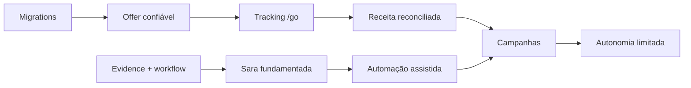

# Roadmap

O roadmap usa gates de saída, não apenas datas. Estimativas dependem de equipe, parceiros e jurídico.

## Fase 0 — Estabilização

**Objetivo:** remover riscos que bloqueiam piloto.

- migrations baseline e drift;
- triagem/upgrade de dependências vulneráveis;
- rate limit/quotas/timeout/kill switch da Sara;
- impedir sync destrutivo;
- Partner/Offer mínimo com allowlist, data e validade;
- CMP/consentimento;
- resolver Vercel Root Directory;
- política legal/editorial mínima;
- CI básico e smoke tests.

**Gate:** vulnerabilidade alta explorável remediada; exceção somente com owner, prazo, controle compensatório e aceite formal; build/CI verdes; oferta inválida não gera CTA; Sara não excede orçamento; banco reproduzível.

## Fase 1 — MVP editorial e afiliados

**Objetivo:** publicar conteúdo confiável e medir saída/receita.

- painel mínimo draft→review→publish;
- modelo editorial com fontes, autoria, revisão, prós/contras e público;
- slug e JSON-LD;
- `/go` first-party e OutboundClick;
- import/postback e Commission ledger;
- template de produto orientado à decisão;
- acessibilidade WCAG AA;
- dashboard básico de funil/EPC/freshness;
- observabilidade/readiness.

**Gate:** 5–20 produtos reais revisados; links/preços válidos; click→commission reconciliável; políticas públicas; E2E crítico verde. Classificação esperada: **piloto controlado**.

## Fase 2 — Sara consultiva

**Objetivo:** recomendação fundamentada, econômica e segura.

- FAQs/cache;
- retrieval sobre evidências aprovadas;
- engine de compatibilidade;
- método R.O.C.H.A.;
- sessão curta/consentida;
- schema de recomendação;
- model routing e fallback;
- telemetria/custos/feedback;
- red-team e avaliação offline.

**Gate:** nenhuma recomendação sem evidência; compatibilidade crítica determinística; custo/conversa dentro do teto; taxa de abstenção e qualidade aprovadas em dataset de avaliação.

## Fase 3 — Curadoria e automação

**Objetivo:** reduzir trabalho sem perder governança.

- Rocha Score versionado;
- ingestão, normalização e dedupe;
- conectores reais;
- scheduler/queue/DLQ;
- enrichment e draft assistidos;
- freshness/expiração;
- busca, hubs, comparações e alertas;
- approvals e audit log para MCP/agentes.

**Gate:** pipeline idempotente; publicação sempre aprovada; fonte/confiança auditáveis; falha externa não altera oferta válida.

## Fase 4 — Campanhas inteligentes

**Objetivo:** distribuir com medição e limites.

- opportunity service;
- campaign brief/variants;
- registry UTM/subid;
- adapters primeiro orgânicos/email;
- experiment framework;
- budget/brand guardrails;
- paid media somente após sinais orgânicos;
- dashboard de margem.

**Gate:** atribuição fecha; orçamento e kill switch testados; nenhuma ativação/aumento sem aprovação; amostra mínima e janela de maturação definidas.

## Fase 5 — Plataforma autônoma

**Objetivo:** operação escalável com autonomia limitada por políticas.

- otimização baseada em margem e qualidade;
- feedback loop de conteúdo/Sara/campanhas;
- autoscaling de jobs;
- detecção de drift e anomalia;
- recomendações personalizadas consentidas;
- governança de modelos, dados e parceiros;
- auditoria contínua e rollback.

**Gate:** autonomia reversível, explicável, limitada por orçamento e com supervisão humana; SLOs, compliance e qualidade sustentados.

## Sequência crítica

## O que não fazer agora

- não lançar campanha paga;
- não publicar catálogo em massa;
- não automatizar gasto/publicação;
- não persistir perfil residencial sem desenho LGPD;
- não usar Order como receita afiliada;
- não fazer reescrita completa;
- não adicionar vetores/RAG antes de fontes e workflow.
