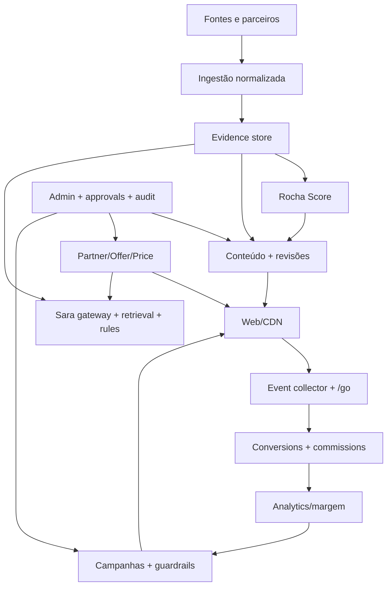

# Rocha Smart Blueprint

## Visão

Ser um dos lugares mais confiáveis do Brasil para entender tecnologia antes de comprar, reduzindo incompatibilidade, arrependimento e desperdício.

## Missão

Transformar especificações, ofertas e contexto doméstico em decisões claras, verificáveis e úteis, mantendo separação transparente entre avaliação editorial e monetização.

## Proposta

**Tech que mora na sua casa — sem comprar no escuro.**

A Rocha Smart não vende nem presta pós-venda do produto indicado. Explica, compara, recomenda com ressalvas e direciona a uma oferta validada de fabricante, loja autorizada ou parceiro identificado.

## Público

- consumidor não especialista;
- comprador que teme incompatibilidade ou devolução;
- usuário de Alexa, Google Home, Apple Home ou ecossistema ainda indefinido;
- famílias que buscam segurança, energia, conforto ou acessibilidade;
- entusiasta que quer análise crítica, não ficha copiada.

## Diferenciais

1. compatibilidade e requisitos antes do benefício promocional;
2. “não compre se” tão visível quanto “por que comprar”;
3. fontes, datas e confiança por decisão;
4. Rocha Score editorial separado da comissão;
5. Sara contextual, fundamentada e econômica;
6. oferta/loja/seller claramente identificados;
7. atualização e correção auditáveis.

## Arquitetura-alvo

## Sara

A Sara não é um vendedor persuasivo; é uma consultora de decisão. Opera em quatro camadas: conteúdo pré-gerado, recuperação/regras, modelo econômico e modelo avançado excepcional. O Método R.O.C.H.A. conduz Resultado, Obstáculo, Compatibilidade, Hierarquia e Ação. Links são resolvidos no servidor; respostas citam evidências ou recusam.

## Rocha Score v0 — hipótese a calibrar

Pesos, cortes e janelas abaixo são proposta inicial, não resultado científico. Antes do uso público, calibrar em um conjunto diverso de produtos com avaliações cegas de pelo menos dois revisores; medir concordância, falsos recomendados/rejeitados e relação com devolução/satisfação. Confiança geral começa como média ponderada por critério, com piso obrigatório para segurança, compatibilidade, oferta e fonte. Validar o corte 0,75 no piloto e versionar mudanças.

### Fórmula editorial (0–100)

| Critério | Peso |
|---|---:|
| Utilidade prática | 15 |
| Custo-benefício + histórico de preço | 15 |
| Qualidade e durabilidade | 12 |
| Compatibilidade/ecossistema | 10 |
| Segurança e privacidade | 10 |
| Reputação + avaliações (nota, volume, qualidade) | 10 |
| Facilidade de uso/instalação | 8 |
| Garantia e assistência | 8 |
| Disponibilidade/loja confiável no Brasil | 5 |
| Risco de devolução, inverso | 4 |
| Inovação relevante | 3 |
| **Total** | **100** |

Comissão não entra. Um `CommercialScore` separado pode considerar comissão, EPC e disponibilidade somente para desempatar produtos editorialmente equivalentes.

### Faixas

- **75–100:** elegível a recomendação, se confiança suficiente.
- **60–74:** conteúdo informativo/com ressalvas e revisão humana.
- **0–59:** não recomendar.

### Bloqueios independentes da nota

- risco elétrico/certificação aplicável;
- voltagem/incompatibilidade Brasil não resolvida;
- seller/canal não confiável;
- claim crítico sem fonte;
- recall/falha grave;
- segurança/privacidade inaceitável;
- produto obsoleto ou indisponível;
- conflito crítico de fonte não revisado.

### Confiança e fontes

Cada critério recebe confiança 0–1. Publicação recomendada exige confiança geral ≥0,75 e cobertura integral de campos críticos. Hierarquia: fabricante/documentação/certificação → teste próprio → laboratório/review técnico confiável → varejista → avaliações agregadas. Conflito fica registrado; fonte superior/recente prevalece, e conflito crítico exige humano.

### Atualização

- preço/estoque: 6–24 h conforme parceiro;
- link: diário e antes de campanha;
- segurança/recall: semanal;
- ficha/score: 90 dias ou evento;
- revisão editorial: anual no máximo.

Guardar `score_version`, pesos, fontes, timestamps, hash, autor, revisor, rationale e overrides.

## Curadoria

Pipeline: candidato → fontes → normalização → score preliminar → revisão técnica → draft → revisão editorial/comercial separada → publicação → freshness → correção/expiração. Patrocínio é atributo visível, nunca autorização para elevar nota.

## Monetização

1. afiliados e parceiros aprovados;
2. patrocínio identificado;
3. publicidade consentida;
4. alertas premium futuros;
5. comparação/serviço futuro com escopo próprio.

Decisão editorial e decisão comercial ficam em serviços, dados e permissões separados.

## Conteúdo e SEO

Tipos: matéria, review, comparativo, ranking, guia e glossário. Hubs por ambiente, objetivo, ecossistema, protocolo, marca e orçamento apenas quando houver conteúdo único. Todo conteúdo indexável exibe autoria, revisão, fontes, datas e disclosure. Dados estruturados refletem apenas fatos visíveis e atuais.

## Campanhas

Campanhas usam produto/oferta/score/freshness, sinais orgânicos e margem. Brief e variantes são versionados, UTMs imutáveis, aprovação humana obrigatória e gasto limitado. Pausar por link/oferta/score/custo. Escalar somente após amostra suficiente e em passos pequenos.

## Automação

Automatizar captura, checagem, dedupe e alertas. Assistir enriquecimento, score, conteúdo e campanhas com revisão. Manter políticas, conflitos, patrocínio, segurança e grandes orçamentos sob decisão humana.

## Analytics

Funil: impressão → visita → leitura → interação → recomendação → partner click → conversão → comissão. Métrica norteadora: **margem de contribuição confiável por sessão**, acompanhada de EPC, RPM, freshness, qualidade editorial e custo da Sara.

## Governança

- RBAC e least privilege;
- approvals e audit log imutável;
- versionamento de conteúdo, score, prompts e schemas;
- proteção e minimização de dados;
- budgets e kill switches;
- monitoramento de bias, alucinação e segurança;
- correção pública e rollback;
- revisão jurídica de LGPD/afiliados/publicidade;
- fornecedor/LLM nunca publica diretamente.

## Roadmap

0. estabilizar e proteger;
1. MVP editorial/afiliado confiável;
2. Sara fundamentada;
3. curadoria e automação assistida;
4. campanhas com dados/guardrails;
5. autonomia limitada e auditável.

## Princípios inegociáveis

1. **Verdade antes da conversão.**
2. **Compatibilidade antes do clique.**
3. **Comissão nunca domina recomendação.**
4. **Toda afirmação relevante tem fonte e data.**
5. **Oferta vencida não recebe CTA.**
6. **IA sem evidência recusa.**
7. **Nenhuma publicação ou gasto irrestrito.**
8. **Privacidade por minimização e consentimento.**
9. **Automação é reversível e auditável.**
10. **Métrica de sucesso inclui confiança, qualidade e margem — não só cliques.**

## Decisão recomendada

Prosseguir incrementalmente. Não lançar publicamente nem escalar mídia no estado atual. Concluir Fase 0 e Fase 1, operar piloto controlado com catálogo pequeno e fontes verificadas, medir receita real e só então ampliar Sara, automação e campanhas.

## Glossário

- **CMP:** plataforma de gestão de consentimento.
- **DLQ:** fila de jobs que falharam definitivamente.
- **E-E-A-T:** sinais de experiência, especialização, autoridade e confiança.
- **EPC:** valor de comissão por clique elegível.
- **HMAC:** assinatura criptográfica com segredo compartilhado.
- **ISR:** regeneração controlada de páginas estáticas no Next.js.
- **RAG:** geração apoiada por recuperação de fontes.
- **RBAC:** autorização baseada em papéis.
- **RPM:** receita por mil sessões/visitas, conforme definição adotada.
- **RUM:** medição de performance com usuários reais.
